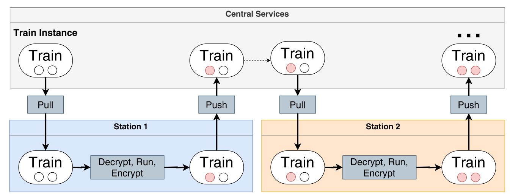

### Description of the scenario

A frequent problem in medical research are legal restrictions regarding the accessibility of patient data, as they contain sensitive information and are subject to special regulatory protection, e.g. by the EU General Data Protection Regulation. Data with a concrete patient reference can only be used for research via four different legal bases: on the basis of the treatment contract, due to legal framework conditions, e.g., for infection protection, by explicit consent of the informed patient, and by anonymization before disclosure. But even if these narrow conditions are fulfilled, the release of data sets offers a potential for misuse, because the control possibilities of non-disclosure after sharing are limited for the data holder and he has to rely on the reliability of the partner. At the same time, the technical and organizational effort required to carry out concrete re-distribution is often underestimated.

It would be far more convenient and secure if data requests were executed locally on the data and the data did not have to travel to the evaluators. This is the principle idea of the Personal Health Train. The metaphor is intentional: the research hypothesis travels from station (data-holding institution) to station in machine-executable form like a train. At each station, the local query is executed or a statistical model is trained. After that, the train travels on, but the data does not leave the location, only aggregated information. Of course, such a concept makes hard demands on standards and security. Execution is always the responsibility of the local site, only signed algorithms are used, and transmission paths and access are secured. But the simplicity of integrating a new site is also important in real life. Data-holding centers cannot build an dedicated infrastructure for every new use case.

 Figure 1 - The Personal Health Train

 

The figure shows an overview of the PHT infrastructure at an abstract level.  The central service coordinates the analysis train from station to station. Each station retrieves the train from a special repository in the Central Service and performs the analysis after decryption. After saving the results (red dots), the train is sent back to the Central Service, and the same process occurs for the following stations until the last station. 

### Summary of main findings

The abstract concept of the Personal Health Train is currently being implemented by various development teams, which have joined forces in a [GOFAIR Implementation Network](https://www.go-fair.org/implementation-networks/overview/personal-health-train/). Although domain-independent in principle, the access problem preferably concerns medical data, so that all use cases of the PHT are currently based on health data. Equally catchy is the use of established standards, as it would be nonsensical to write special queries for each individual station. For the area of structured clinical data, mapping to FHIR makes sense if it is not already standardized. Of course, this involves an effort that should not be underestimated in individual cases, especially since FHIR can be extended in various ways, but a Common Data Model is a prerequisite for the scenario.
Another challenge of the approach is that the queries have to be ready and executable in advance and cannot adapt to unforeseen situations. Experience teaches that the implementation of individual functions of the FHIR standard differs in different FHIR servers, e.g. the support of certain modifiers in FHIR Search. Also, the generic structure has to be considered, i.e. one site may have referenced diagnoses to cases and another site may have referenced cases to diagnoses.

### HL7 FHIR facilitating FAIR principles

This use case focuses in particular on the interoperability axis. FHIR offers the advantage here of a modular concept of linked resources, each representing a typical artifact of the domain. At the same time, the learning curve for developers in particular is lower than for other HL7 standards because modern web technologies such as REST, HTTP, TLS and OAuth are used. The use of international terminologies such as ICD-10, LOINC or SNOMED CT is still far too rare in practice; FHIR can, however, support their introduction for the sake of argument.
